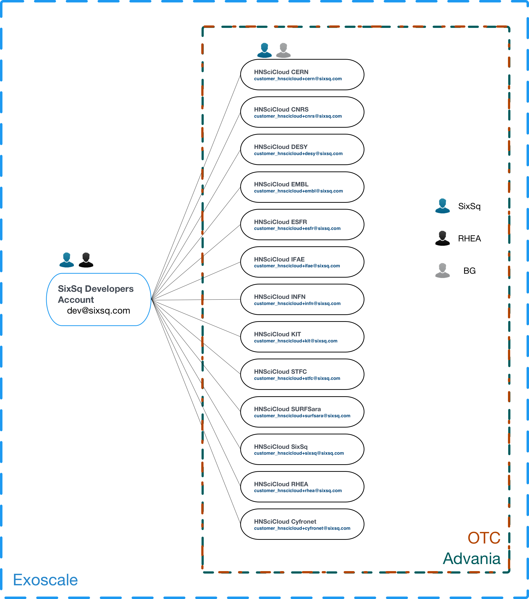
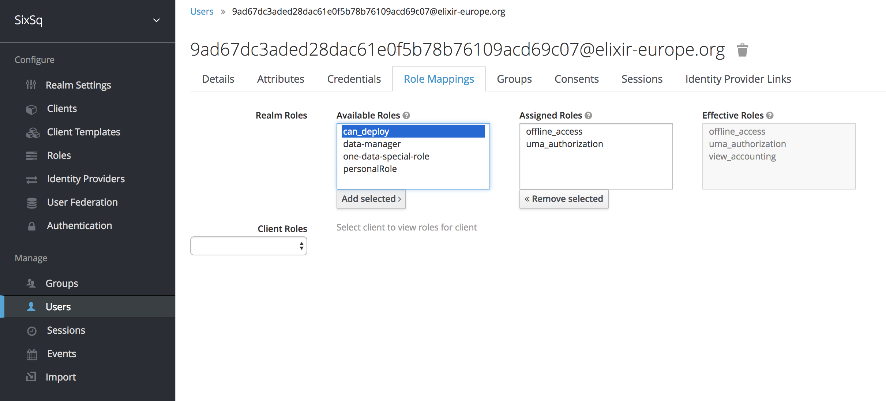

Cloud Provider Configuration
============================

The general configuration of the cloud accounts follow a hierarchical
approach, as show in the picture below.

For Exoscale, there is a top-level organization which owns and manages
all the Buyers Group tenants. On each tenant then, the respective
organization administrator is also given ownership.  For OTC and
Advania, this top-level organization does not exist but the Buyers
Group tenants are structured the same way - with the respective tenant
administrator as owner and a SixSq (monitoring) account as a technical
user.

With this setup, it is ensured that all the cloud accounts will be 
automatically setup in Nuvla, given that users have the 
necessary rights to provision resources.

To grant these rights, each account manager should:

 1. Login to `SixSq's Federated Identity Portal`_
 2. Select the users (or groups of users) who need provisioning
    access, and assign them with the role **can_deploy** (which has
    already been created).

Once this is done, the affected users will automatically get access to
the cloud credentials for Exoscale, OTC and Advania in Nuvla, upon
login.

.. _`SixSq's Federated Identity Portal`: https://fed-id.nuv.la/auth
