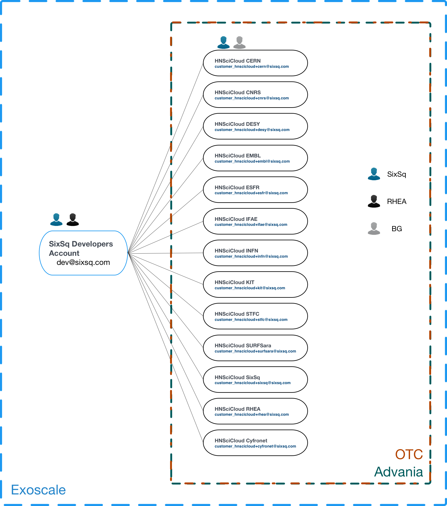
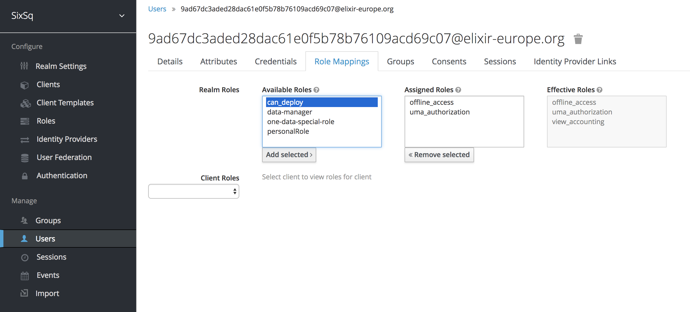

Account Configuration
=====================

To use Nuvla to provision the data management services or cloud
applications on the IaaS cloud infrastructures, you must configure
your Nuvla account.  To access your user profile, click on "Profile"
link under your username.

.. figure:: ../images/nuvlaUserProfile.png
   :alt: Accessing Your User Profile
   :width: 100%
   :align: center

To update your user profile, click on the "Edit..." on the right side
below the page header.

Remote Machine Access
---------------------

To allow you have remote access to the (Linux) virtual machines that
you deploy, you should provide a public SSH key. Once this key has
been added to your profile, Nuvla will automatically configure all
deployed virtual machines with this key, giving you 'root' access to
your deployed machines. The instructions for creating an SSH key pair
and configuring your profile can be found in the `Remote Machine
Access`_ section of the SlipStream documentation.  This documentation
also describes the installation of a "Remote Desktop Connection"
client for accessing Windows machines.

Cloud Provider Configuration
----------------------------

The general configuration of the cloud accounts follow a hierarchichal
approach, as show in the picture below.

For Exoscale, there is a top-level organization which owns and manages
all the Buyers Group tenants. On each tenant then, the respective
organization administrator is also given ownership.  For OTC and
Advania, this top-level organization does not exist but the Buyers
Group tenants are structured the same way - with the respective tenant
administrator as owner and a SixSq (monitoring) account as a technical
user.

With this setup, it is ensured that all the cloud accounts will be 
automatically setup in Nuvla, given that users have the 
necessary rights to provision resources.

To grant these rights, each account manager should:

 1. Login to `SixSq's Federated Identity Portal`_
 2. Select the users (or groups of users) who need provisioning
    access, and assign them with the role **can_deploy** (which has
    already been created).

Once this is done, the affected users will automatically get access to
the cloud credentials for Exoscale, OTC and Advania in Nuvla, upon
login.

.. _`SixSq's Federated Identity Portal`: https://fed-id.nuv.la/auth

