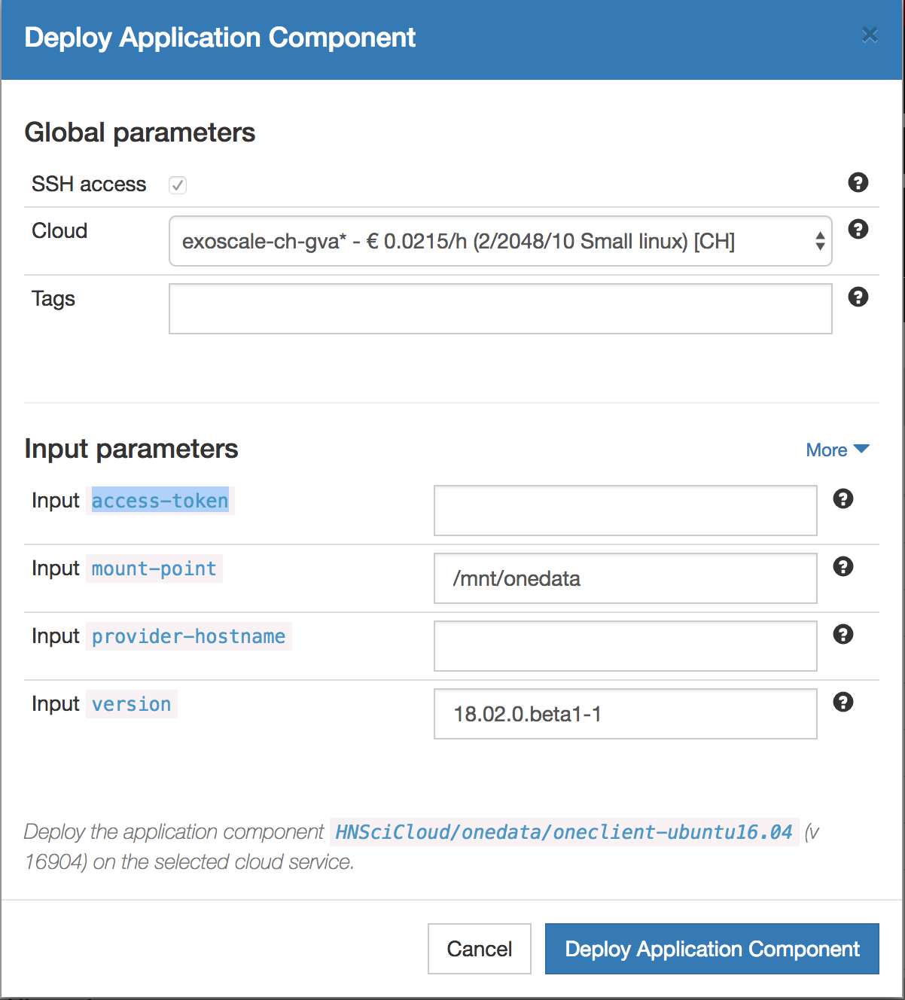

Deploying on Nuvla
==================

.. _libcloud-deploy:

Deploying a base image
----------------------
- After logging into Nuvla open the `Centos-libcloud` application from the following link:

https://nuv.la/module/Training/Centos-libcloud

- Click on its Deploy button

- On the "Deploy Application Component" dialog you may optionally set the Tag field with comma separated values

Because we will later use it when presenting the :ref:`libcloud` feature, we may set the values to "libcloud, training"

Deploying a more complex application
------------------------------------

After log in to Nuvla, visit the URL where the component is defined :

https://nuv.la/module/apps/LAMP/lamp-deployment

.. _oneclient:

Deploying a OneClient application
---------------------------------
After log in to Nuvla, visit the URL where the component is defined :

https://nuv.la/module/HNSciCloud/onedata/oneclient-ubuntu16.04

It is setup a OneClient instance onto an Ubuntu system

It is expecting 4 input parameters

1. access-token

While it should be normally be provided by your Administrator, we have set a token for the purpose of this training :
Set the Access token field to `MDAxNWxvY2F00aW9uIG9uZXpvbmUKMDAzMGlkZW500aWZpZXIgZDZiMjY2OTQyNzVkZmE5ZjBkZDgwNDU4ZTk2ODIwMmMKMDAxYWNpZCB00aW1lIDwgMTU1MzMzNTk4OQowMDJmc2lnbmF00dXJlIN0275UNBA02jdBNO961FDxeD4BQFt2DH5HN5t4QWQMaybCg`

2. mount point

    It is the location where data coming coming from OneProvider spaces will be mounted. You can keep the default

3. provider-hostname

This the Endpoint URL of your OneProvider instance
Here we will set the value : `op-exo.hn.nuv.la`

4.Version : The OneClient version is set to a default value which we will not touch

- Optionally set a tag value of your choice (e.g "training") in the Tags field

- Hit the "Deploy Application Component" button

We will keep the instance running for now and will reuse it later when using :ref:`onedata`
