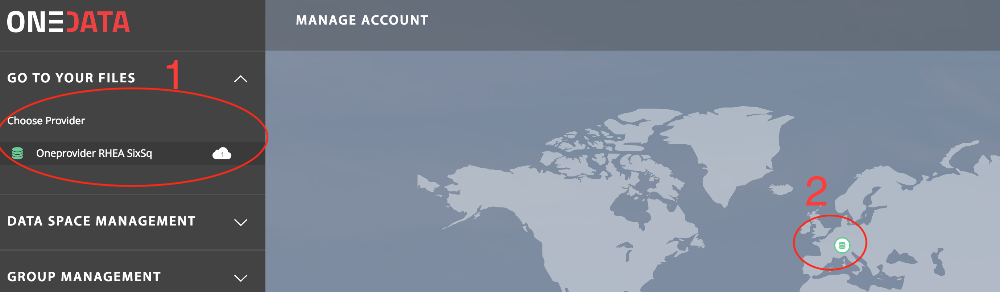
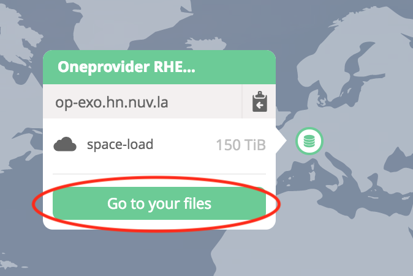
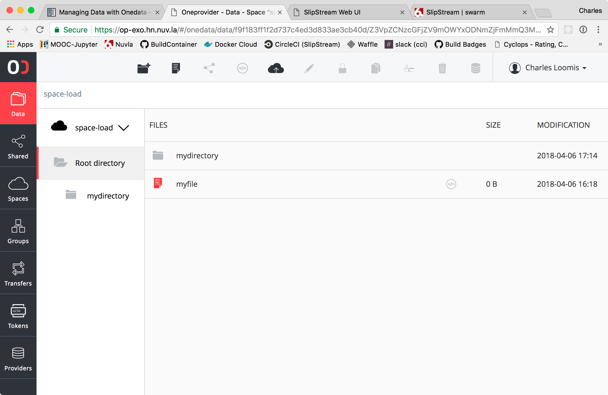

.. _onedata:

OneData
========

Managing files via web interface
--------------------------------

All files in Onedata are organized in spaces. The Web User interface allows for uploading new files as well as opening existing files.

A OneZone Web interface is already running at https://onezone.rhea-hn.com

- Use your federated Login

- Navigate to your provider

- Navigate to your files

You will be redirected to the OneProvider page where URL starts with `https://op-exo.hn.nuv.la/`

In order to upload a file simply open the folder in which the file should be placed and drag the file into the browser window

Opening or downloading a file simply requires double clicking on the file in the file window.

*Make sure that the popups for this browser window are not blocked, and unblock them if necessary.*

From this Web interface you can create some Directory and files.
Additionally you may use the Upload button

Access files via POSIX
----------------------

Files can also be accessed directly via POSIX protocol.

SSH connection to the VM
^^^^^^^^^^^^^^^^^^^^^^^^

- From the Nuvla dashboard, identify the deployment you have started when :ref:`oneclient`

The component name should start with oneclient-ubuntu...

- Click on its Service URL column (the value starts with ssh://...)

 Assuming you added your SSH public key to your Nuvla profile (see :ref:`ssh`),
 you should be redirected to the Centos 7 VM , with user root
 The VM is already running an instance of OneClient process to provide POSIX access to your data

- Browse the directory which was set as `mount point` when :ref:`oneclient`

If you haven't changed the default it should be::

  $ ls -l /mnt/onedata

You should find a 'space-load' folder which was provided by your OneZone admin

- Read files from OneClient::

  $ ls -l ls -l /mnt/onedata/space-load/

It should reflect the files you uploaded from the web interface

- Creating files from OneClient

Either::

  $ touch /mnt/onedata/space-load/somefile

Or::

  $ cp somefile /mnt/onedata/space-load/

After refreshing your OneProvider web page, you should see your new files in the web interface

